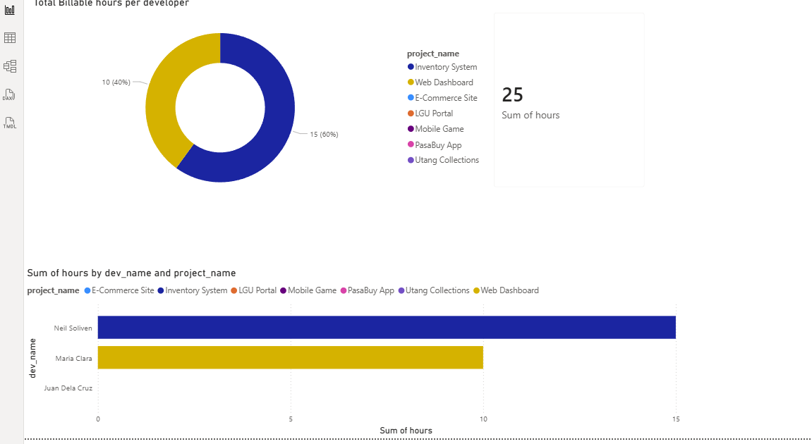

# SQL-Data-Analytics-Portfolio

# Developer Workload & Resource Allocation Analytics

## 📌 Project Overview
This project demonstrates the application of SQL and Data Analytics to solve resource management challenges in a software development environment. [cite_start]Inspired by my experience as a **Junior Web Developer at Vertex**, I built this system to monitor team productivity and identify underutilized assets.

## 🛠️ Technical Stack
* [cite_start]**Database:** MySQL (neil_data_training) [cite: 3]
* [cite_start]**Analytics Tool:** SQL Views, Joins, and Aggregations [cite: 3]
* [cite_start]**Visualization:** Power BI [cite: 3]

## 📊 Key Business Insights
Using this dataset, I developed a dashboard that tracks:
* [cite_start]**Total Billable Hours:** Consolidated view of project hours (e.g., 25 total hours tracked)[cite: 3].
* [cite_start]**Workload Distribution:** Identified gaps where specific developers (e.g., Juan Dela Cruz) had zero project assignments[cite: 3].
* [cite_start]**Team Performance:** Visualized productivity across different teams like Vortex-5 and Hufflepuff[cite: 3].

## 🔍 SQL Highlights
I implemented advanced SQL techniques to ensure data accuracy:
1.  [cite_start]**LEFT JOINs:** To capture all developers, including those without current projects[cite: 3].
2.  [cite_start]**COALESCE:** To handle NULL values and provide "Idle" or "No Project" labels for cleaner reporting[cite: 3].
3.  [cite_start]**SQL Views:** Created `v_developer_workload` to serve as a live data source for Power BI integration[cite: 3].

## 📂 Repository Contents
* [cite_start]`Dump20260426.sql`: Full database export including schema, seed data, and views[cite: 5].

---
*Developed by Neil Russel D. Soliven | [cite_start]Junior Data Analyst & Web Developer*

